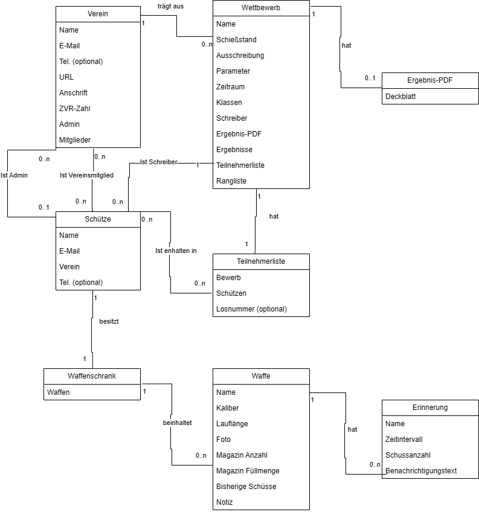
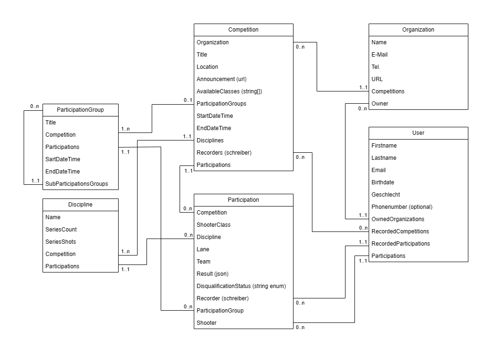

# Schiessmeister

Schiessmeister is a specialized shooting competition management system developed to address the growing needs of shooting clubs and competition organizers. The project emerged from the recognition that many shooting clubs still rely on manual processes or outdated systems for managing their competitions and members. This digital transformation initiative aims to modernize the shooting sports administration by providing a comprehensive, user-friendly solution that streamlines the entire competition lifecycle.

The system is designed to serve multiple stakeholders:

-   Competition organizers who need efficient tools for event management
-   Shooting clubs looking to digitize their administrative processes
-   Participants who want easy access to competition information and results
-   Club administrators who need comprehensive member and equipment management

## Core Use Cases

The system supports the following core use cases:

### Competition Management

-   Create and manage shooting competitions
-   Real-time competition monitoring and control
-   Live result display and tracking
-   Comprehensive competition overview dashboard

### Participant Management

-   Add and manage participants for each competition
-   Assign points to participants
-   Track participant performance and statistics

### User Management

-   Secure registration and login system
-   Role-based access control (organizers, participants)
-   Identity management and authentication

## Domain Model

## Backend - schiessmeister-csharp

The backend serves as the robust foundation of Schiessmeister, providing a secure and scalable API that handles all core business logic, data persistence, and real-time communication. Built with modern .NET technologies, it ensures reliable performance and maintainability while supporting the complex requirements of shooting competition management.

### Features

-   Member management and authentication
-   Competition organization and result tracking
-   Shooting range scheduling and booking
-   Equipment inventory management
-   Performance statistics and reporting
-   User role management (admin, member, guest)
-   Real-time updates via WebSocket/SignalR
-   Live competition monitoring

### Tech-Stack

-   ASP.NET Core 8.0
-   Entity Framework Core
-   SQL Server
-   RESTful API architecture
-   JWT Authentication
-   Identity Framework
-   WebSocket/SignalR for real-time communication

### Entity Relationship Model

### API Model

| URI                                      | Title                                    | HTTP Method | HTTP Response                                   | Comment                                                                                                                       |
| ---------------------------------------- | ---------------------------------------- | ----------- | ----------------------------------------------- | ----------------------------------------------------------------------------------------------------------------------------- |
| /organizations/[id]/competitions         | Get Competitions                         | GET         | 200 OK 404 NOT FOUND                         | Get the competitions with their direct attributes.                                                                            |
| /organizations/[id]/competitions         | Create a competition                     | POST        | 201 CREATED 404 NOT FOUND 400 BAD REQUEST | Also creates a default ParticipationGroup with no participations and all disciplines that where sent with this request. |
|                                          |                                          |             |                                                 |                                                                                                                               |
| /competitions/[id]                       | Get the Competition                      | GET         | 200 OK 404 NOT FOUND                         | Returns the competitions with ist foreign relations itemized. (ParticipationGroup, Discipline, Participation)              |
| /competitions/[id]                       | Update the Competition                   | PUT         | 200 OK 404 NOT FOUND 400 BAD REQUEST      |                                                                                                                               |
| /competitions/[id]                       | Delete the Competition                   | DELETE      | 204 NO CONTENT 404 NOT FOUND                 |                                                                                                                               |
| /competitions/[id]/participation-groups  | Create a ParticipationGroup              | POST        | 201 CREATED 404 NOT FOUND 400 BAD REQUEST |                                                                                                                               |
| /competitions/[id]/disciplines           | Create a Discipline                      | POST        | 201 CREATED 404 NOT FOUND 400 BAD REQUEST |                                                                                                                               |
| /competitions/[id]/teams                 | Get all used Team names                  | GET         | 200 OK                                          | Team names which are used by any Participation of the Competition.                                                         |
| /competitions/[id]/leaderboard           | Get the current Leaderboard              | GET         | 200 OK                                          |                                                                                                                               |
|                                          |                                          |             |                                                 |                                                                                                                               |
| /disciplines/[id]                        | Update the Discipline                    | PUT         | 200 OK 404 NOT FOUND 400 BAD REQUEST      |                                                                                                                               |
| /disciplines/[id]                        | Delete the Discipline                    | DELETE      | 204 NO CONTENT 404 NOT FOUND                 |                                                                                                                               |
|                                          |                                          |             |                                                 |                                                                                                                               |
| /participation-group/[id]                | Update the ParticipationGroup            | PUT         | 200 OK 404 NOT FOUND 400 BAD REQUEST      |                                                                                                                               |
| /participation-group/[id]                | Delete the ParticipationGroup            | DELETE      | 204 NO CONTENT 404 NOT FOUND                 |                                                                                                                               |
| /participation-group/[id]/sub-groups     | Create a Sub-ParticipationGroup          | POST        | 201 CREATED 404 NOT FOUND 400 BAD REQUEST |                                                                                                                               |
| /participation-group/[id]/participations | Create a Participation                   | POST        | 201 CREATED 404 NOT FOUND 400 BAD REQUEST |                                                                                                                               |
|                                          |                                          |             |                                                 |                                                                                                                               |
| /participations/[id]                     | Update the Participation                 | PUT         | 200 OK 404 NOT FOUND 400 BAD REQUEST      |                                                                                                                               |
| /participations/[id]                     | Delete the Participation                 | DELETE      | 204 NO CONTENT 404 NOT FOUND                 |                                                                                                                               |
|                                          |                                          |             |                                                 |                                                                                                                               |
| /users?[searchterm]                      | Get all Users considering the searchterm | GET         | 200 OK                                          |                                                                                                                               |
| /users/[id]                              | Get the User                             | GET         | 200 OK 404 NOT FOUND                         |                                                                                                                               |
| /users/[id]                              | Delete the User                          | DELETE      | 204 NO CONTENT 404 NOT FOUND                 |                                                                                                                               |

## Frontend - schiessmeister-client

The frontend delivers an intuitive and responsive user experience, enabling users to interact with the system's features through a modern web interface. It focuses on providing real-time updates, clear data visualization, and seamless navigation across all device types, making competition management accessible and efficient.

### Features

-   Responsive dashboard interface
-   Real-time competition updates
-   Interactive shooting range booking calendar
-   Member profile management
-   Performance statistics visualization
-   Mobile-friendly design
-   Live competition monitoring interface
-   Intuitive competition management tools

### Tech-Stack

-   React 18
-   Vite
-   TypeScript
-   Modern CSS (Tailwind/styled-components)
-   REST API integration
-   WebSocket/SignalR client integration

All rights reserved © Schiessmeister 2025
